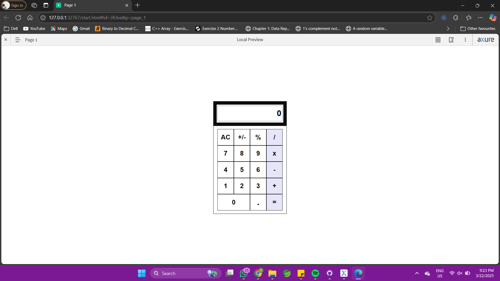
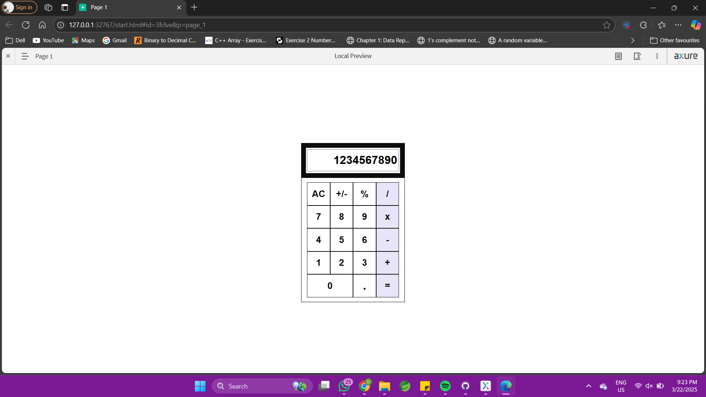

# Axure Calculator Prototype
This project is a basic Calculator prototype created using Axure RP. The calculator performs standard operations such as addition, subtraction, multiplication, and division, and features an interactive design to simulate real-world behavior.

## Features
* Basic Arithmetic Operations: Addition (+), Subtraction (-), Multiplication (×), Division (÷).
* Interactive Buttons: All number buttons (0-9).
* Responsive Design: User-friendly design optimized for easy interaction.
## Step 1: Set Up the Project
1. Open Axure RP and create a new project.
2. Rename the page to something like “Calculator.”

## Step 2: Design the Layout
1. Create the Calculator Screen:
* Use rectangles to create the basic shape of the calculator. Adjust the size of the rectangle to fit a calculator layout.
* Inside the rectangle, add labels for displaying numbers (e.g., an area for the display).
2. Create the Buttons:
- Draw 16 buttons for the numbers (0-9) and operations (+, -, ×, ÷, =, etc.). You can use rectangles and add text labels to represent each button.
- Group the buttons logically in rows, such as:
  - Row 1: 7, 8, 9, ÷
  - Row 2: 4, 5, 6, ×
  - Row 3: 1, 2, 3, -
  - Row 4: 0, ., =, +
    
## Step 3: Add Variables for the Calculator
1. You will need to use variables to store the values entered by the user.
- Go to the Variables panel and create variables such as:
  - currentValue (to hold the current input value)
  - previousValue (to hold the value before an operator is pressed)
  - operator (to store the selected operation)
2. Set Initial Values:
  - Set the initial value of currentValue and previousValue to 0.
  - Set the operator variable to an empty string.

## Step 4: Add Interactions
1. Number Buttons:
- For each number button (0-9), add an onClick interaction to append the number to the current display.
  - Action: Set the currentValue variable to currentValue + "button_number".

## Step 5: Display the Current Value
1. Use a dynamic panel or text widget to display the current number.

- Bind the text field to the currentValue variable to update the display automatically when a button is pressed.

## Step 6: Preview the Calculator
1. Preview the prototype to test the functionality.
2. Click the buttons, and the calculator should perform the operations based on the inputs and operators selected.

## Future Developments
* Interactive Buttons: decimal point, and operation buttons.
* Result Calculation: The calculator performs calculations and displays the result when the "=" button is clicked.
* Clear Functionality: Option to clear the display and reset values.

## Screenshots

---

